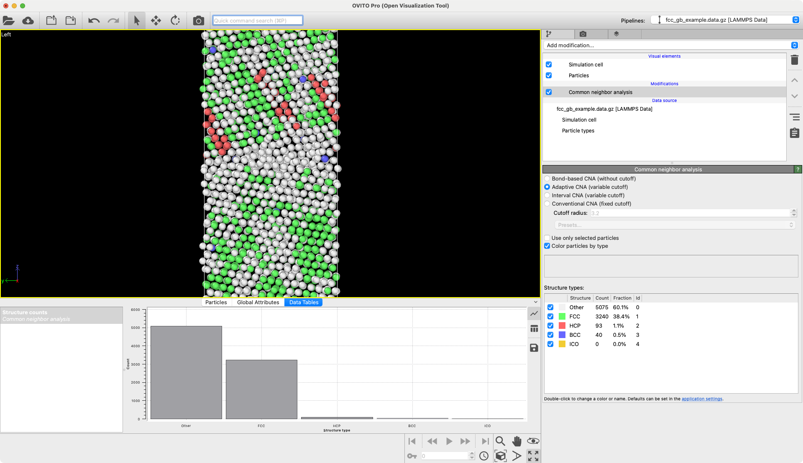

# Score-based Denoising

This is a wrapper for *OVITO* around the "Score-based denoising for atomic structure identification" presented in this [graphite repo](https://github.com/LLNL/graphite/). Further information and the official citation on [arXiv](https://doi.org/10.48550/arXiv.2212.02421).

## Description
Score-based denoising iteratively subtracts thermal vibrations or other pertubations from atomistic trajectories.

As described by the original authors in their abstract:

*"We propose an effective method for removing thermal vibrations that complicate the task of analyzing complex dynamics in atomistic simulation of condensed matter. Our method iteratively subtracts thermal noises or perturbations in atomic positions using a denoising score function trained on synthetically noised but otherwise perfect crystal lattices. The resulting denoised structures clearly reveal underlying crystal order while retaining disorder associated with crystal defects. Purely geometric, agnostic to interatomic potentials, and trained without inputs from explicit simulations, our denoiser can be applied to simulation data generated from vastly different interatomic interactions. The denoiser is shown to improve existing classification methods such as common neighbor analysis and polyhedral template matching, reaching perfect classification accuracy on a recent benchmark dataset of thermally perturbed structures up to the melting point. Demonstrated here in a wide variety of atomistic simulation contexts, the denoiser is general, robust, and readily extendable to delineate order from disorder in structurally and chemically complex materials."*

Hsu, T., Sadigh, B., Bertin, N., Park, C. W., Chapman, J., Bulatov, V., & Zhou, F. (2022). Score-based denoising for atomic structure identification (Version 3). arXiv. https://doi.org/10.48550/ARXIV.2212.02421

## Parameters 
- "Number of denoising steps" | `steps`: Number of denoising interations taken. More iterations require more time. You can check the mean displacement per iteration graph to assess convergence.
- "Nearest neighbor distance" | `scale` : Estimation of the nearest neighbor distance used to scale the coordinates before they are input into the model. If this is `None` OVITO will try to estimate the correct nearest neighbor distance. 
- "Crystal structure / material system" | `structure` : Allows you to select one of: "FCC", "BCC", "HCP", or "SiO2", depending on your input structure. Note, that an SiO2 structure requires a type named "Si". 
- "Device" | `device`: Allows you to select your computing device from: "cpu", "cuda", "mps". Only available devices will be shown. Please read the "Installation" section for additional information.

## Example

Score-based denoising __off__:

Score-based denoising __on__:


## Installation
- *OVITO PRO* built-in Python interpreter
```
ovitos -m pip install --user git+https://github.com/nnn911/ScoreBasedDenoising.git
``` 
- Standalone Python package or Conda environment
```
pip install --user git+https://github.com/nnn911/ScoreBasedDenoising.git
```
- Please note that the `--user` tag is recommended but optional and depends on your Python installation.

By default this will install the CPU version of [PyTorch](https://pytorch.org/get-started/locally/) and [PyG](https://pytorch-geometric.readthedocs.io). 

On Mac, the `mps` backend will also be presented. This is mostly for future proofing since currently not all required PyTorch and PyG methods have been ported to `mps`.

On other platforms you can install the CUDA accelelerated versions of PyTorch and PyG yourself. At this point, you should be able to select `CUDA` in the modifier device selection to run model inference on GPU.

## Technical information / dependencies
Tested on:
- OVITO == 3.9.1
- torch == 1.11.0 | 2.0.1
- torch-geometric == 2.0.4 | 2.3.1

## Contact
Daniel Utt utt@ovito.org