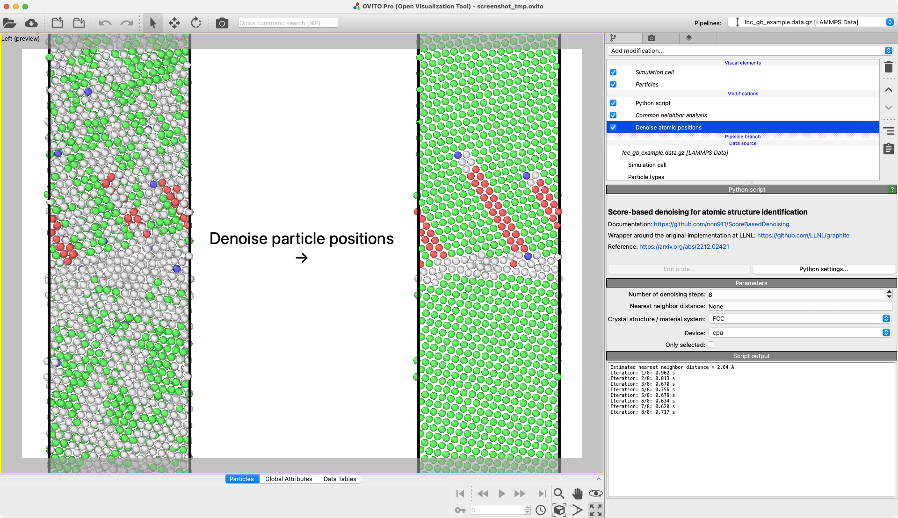

# Score-based Denoising

This is a wrapper for *OVITO* around the "Score-based denoising for atomic structure identification" presented in this [graphite repo](https://github.com/LLNL/graphite/). Further information can be found in their [publication](https://doi.org/10.1038/s41524-024-01337-z).

## Description

Score-based denoising iteratively subtracts thermal vibrations or other pertubations from atomistic trajectories.

As described by the original authors in their abstract:

*"We propose an effective method for removing thermal vibrations that complicate the task of analyzing complex dynamics in atomistic simulation of condensed matter. Our method iteratively subtracts thermal noises or perturbations in atomic positions using a denoising score function trained on synthetically noised but otherwise perfect crystal lattices. The resulting denoised structures clearly reveal underlying crystal order while retaining disorder associated with crystal defects. Purely geometric, agnostic to interatomic potentials, and trained without inputs from explicit simulations, our denoiser can be applied to simulation data generated from vastly different interatomic interactions. The denoiser is shown to improve existing classification methods, such as common neighbor analysis and polyhedral template matching, reaching perfect classification accuracy on a recent benchmark dataset of thermally perturbed structures up to the melting point. Demonstrated here in a wide variety of atomistic simulation contexts, the denoiser is general, robust, and readily extendable to delineate order from disorder in structurally and chemically complex materials."*

[Hsu, T., Sadigh, B., Bertin, N., Park, C. W., Chapman, J., Bulatov, V. & Zhou, F. Score-based denoising for atomic structure identification. npj Comput Mater 10, (2024).](https://doi.org/10.1038/s41524-024-01337-z)

## Parameters

| GUI name                                | Python name     | Description                                                                                                                                                                                                                                                                                                                                                         | Default |
|-----------------------------------------|-----------------|---------------------------------------------------------------------------------------------------------------------------------------------------------------------------------------------------------------------------------------------------------------------------------------------------------------------------------------------------------------------|---------|
| **Number of denoising steps**           | `steps`         | Number of denoising iterations taken. More iterations require more time. You can check the mean displacement per iteration graph to assess convergence.                                                                                                                                                                                                             | `8`     |
| **Nearest neighbor distance**           | `scale`         | Estimation of the nearest neighbor distance used to scale the coordinates before they are input into the model. If this is `None`, OVITO will try to estimate the correct nearest neighbor distance.                                                                                                                                                                | `None`  |
| **Crystal structure / material system** | `structure`     | Allows you to select one of: "FCC", "BCC", "HCP", or "SiO2", depending on your input structure. Note that an SiO2 structure requires a type named "Si" and "O". If you don't want to use any of the default material systems, you can select "Custom". In that case, OVITO will not estimate the "Nearest neighbor distance" and it has to be provided by the user. | `None`  |
| **Model file path**                     | `model_path`    | Allows you to define a custom PyTorch model. The model will be loaded from the path entered. If this is set to `None`, the default models for "SiO2" or "Cu" shipped with [graphite](https://github.com/LLNL/graphite/) will be loaded.                                                                                                                             | `None`  |
| **Device**                              | `device`        | Allows you to select your computing device from: "cpu", "cuda", "mps". Only available devices will be shown. Please read the "Installation" section for additional information.                                                                                                                                                                                     | `cpu`   |
| **Only selected**                       | `only_selected` | Apply the modifier only to the selected particles. Following the convention set by other modifiers, even atoms that are not selected will be used as neighbors.                                                                                                                                                                                                     | `False` |

## Example



## Installation

> [!IMPORTANT]  
> This approach might not work depending on your plattform 
> Please use conda if you encounter any issues

- OVITO Pro [integrated Python interpreter](https://docs.ovito.org/python/introduction/installation.html#ovito-pro-integrated-interpreter):
  ```
  ovitos -m pip install --user git+https://github.com/ovito-org/ScoreBasedDenoising.git
  ``` 
  The `--user` option is recommended and [installs the package in the user's site directory](https://pip.pypa.io/en/stable/user_guide/#user-installs).

- Other Python interpreters or Conda environments:
  ```
  pip install git+https://github.com/ovito-org/ScoreBasedDenoising.git
  ```

By default this will install the CPU version of [PyTorch](https://pytorch.org/get-started/locally/) and [PyG](https://pytorch-geometric.readthedocs.io). 

On Mac, the `mps` backend will also be presented. This is mostly for future proofing since currently not all required PyTorch and PyG methods have been ported to `mps`.

On other platforms you can install the cuda accelelerated versions of PyTorch and PyG yourself. At this point, you should be able to select `cuda` in the modifier device selection to run model inference on GPU.

### Conda + cuda on Windows 11 example

```
conda create -n denoise -c conda-forge python=3.10
conda activate denoise
conda install --strict-channel-priority -c https://conda.ovito.org -c conda-forge ovito==3.10.5
conda install install pytorch pytorch-cuda=12.1 -c pytorch -c nvidia -c conda-forge
conda install pyg -c pyg -c conda-forge
conda install -c conda-forge ase pandas e3nn
pip install git+https://github.com/nnn911/ScoreBasedDenoising.git
```

## Technical information / dependencies
Tested on (using conda):
- OVITO == 3.10.5
- torch == 2.2.2
- torch-geometric == 2.5.3

## Contact
Daniel Utt utt@ovito.org
